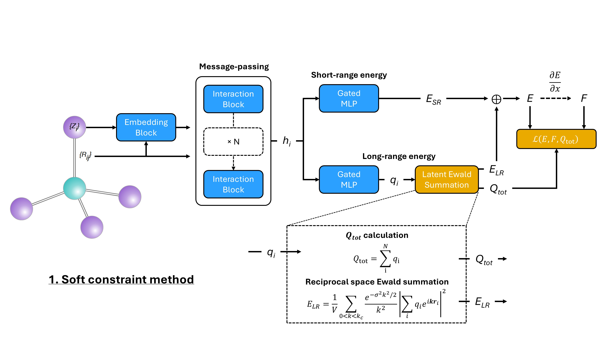
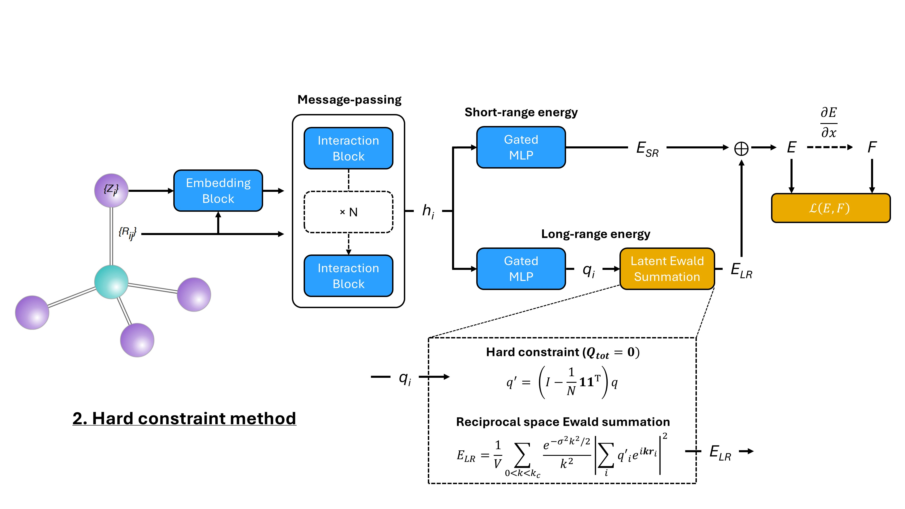

<h1>
<p align="center">
    
</p>
</h1>

<!-- <h1 align="center">MatterSim</h1> -->

<h4 align="center">

[](https://arxiv.org/abs/2405.04967)
[](https://python.org/downloads)
[](https://pepy.tech/projects/mattersim)
</h4>


MatterSim is a deep learning atomistic model across elements, temperatures and pressures.

We have implemented the [Latent Ewald Summation](https://github.com/ChengUCB/les) with charge constraints in order to allow efficient learning of long-range interactions.

## Charge constraints

<p align="center">

</p>

Soft constraint method utilizes the loss function to enforce charge neutrality.
```math
\mathcal{L}
= \alpha_E\left\Vert E - \hat{E} \right\Vert^2
+ \frac{\alpha_F}{N} \sum_{i=1}^{N}
\left\Vert \mathbf{F}_i - \left( -\,\frac{\partial \hat{E}}{\partial \mathbf{R}_i} \right) \right\Vert^2
+ 
\alpha_Q \left\Vert \sum_i^N \hat{Q}_i \right\Vert^2
```
<p align="center">

</p>
Hard constraint method involves the subtraction of mean predicted charges to enforce zero sum. 

## Summary
We find that the **hard constraint method works better** in terms of the physical meaningfulness of the predicted atomic charges. For the water systems, it has correctly produced positive charges for H atoms and negative charges for O atoms, with the magnitude ratio of 2:1. We also demonstrate the molecular dynamics performance of the `mattersim-LES` on the Zn ion solvation system, which correctly reproduced the coordination number and the Zn-O radial distribution function against the reported DFT baseline. 

Results and visualizations can be found in jupyter notebooks in the `/water` folder.


